# Helicopter — portfolio slide deck

Preview in Cursor / VS Code Markdown Preview (Mermaid enabled). Images are live captures of the local viewer and client on 2026-09-22, plus frames from the reconstruction source video.

---

## 1 — Title

**A modular autonomy stack for a software-first helicopter**

Voice or text becomes a typed mission. A deterministic safety gate decides whether it may fly. A thin adapter talks to PX4. Perception and 3D reconstruction run on recorded video so the system can be developed without flying.

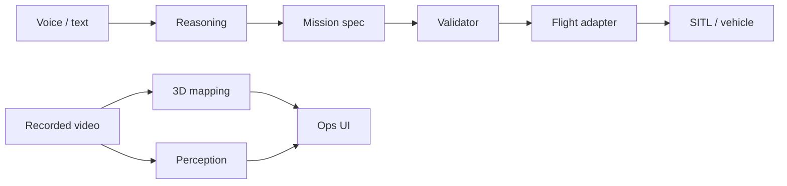

Say: *This is not a finished aircraft. It is the software architecture and the parts I can demo today.*

---

## 2 — Problem

**The hard problem is not the model**

Putting speech and an LLM on a vehicle is easy. Keeping probabilistic models away from the swashplate is the work.

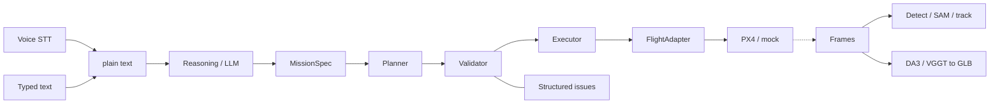

| Layer | Job | Must not do |
|---|---|---|
| Human interface | STT or typed text → plain string | Emit setpoints or MAVLink |
| Reasoning | Text → schema-validated MissionSpec | Call the flight adapter |
| Mission | Plan, validate, execute in order | Skip the safety gate |
| Flight | Abstract commands → PX4 / other FC | Parse natural language |
| Perception / mapping | Frames → tracks, masks, GLB | Arm or move the vehicle |

Say: *I can swap Whisper, DeepSeek, or PX4 without rewriting the rest.*

---

## 3 — Safety architecture

**The LLM never flies the aircraft**

Every plan — script, human, or future model — hits the same validator.

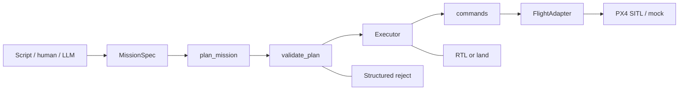

- Illegal altitude or geofence is a structured reject, not a prompt hope.
- Abort is explicit RTL or land.
- A failed command stops the mission; it does not auto-land.
- Reasoning is not built yet. The contracts already are.

Say: *The validator is code, not convention. Nothing — including an LLM — can bypass it.*

---

## 4 — Live demo

**What I can show in two minutes**

`python client/launch.py` → Thin Client Composer on `:5174`

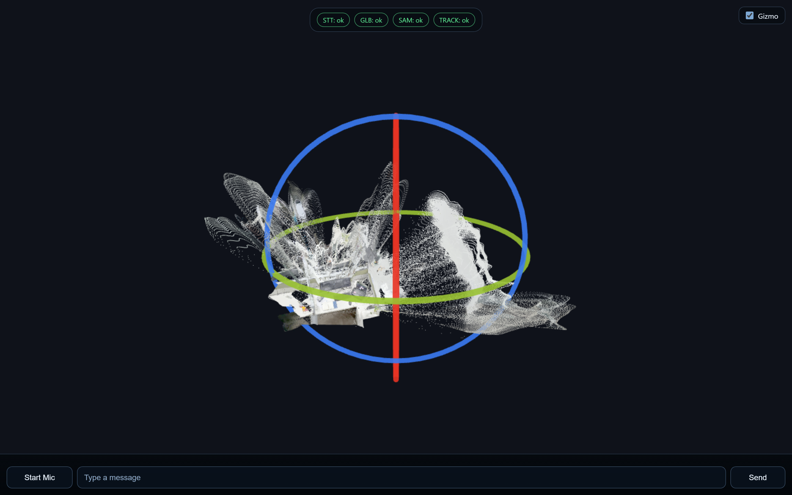

Captured from the running client with STT, GLB, SAM, and TRACK all healthy.

**STT — voice becomes a track command**

Say “keyboard.” Faster-whisper `medium.en` (final) / `tiny.en` (interim) writes the transcript into the chat dock; the tracker arms on that text.

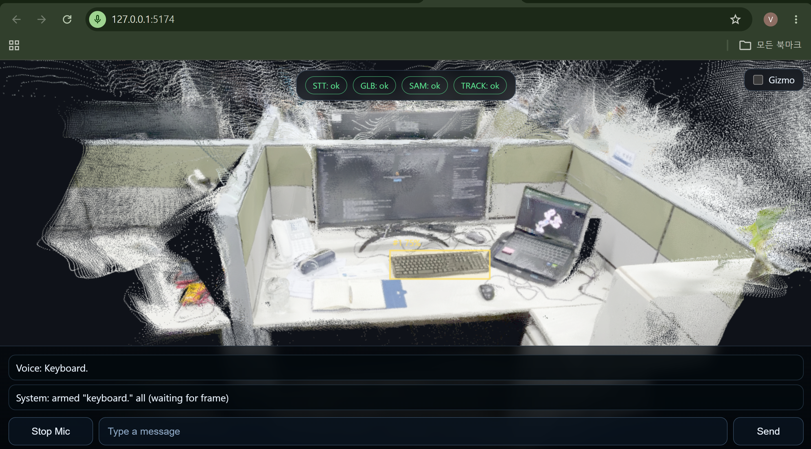

**Image recognition — open-vocab detect from typed text**

Type `monitor`. Grounding DINO returns a scored box (73% on the display). Same path works for `notebook`.

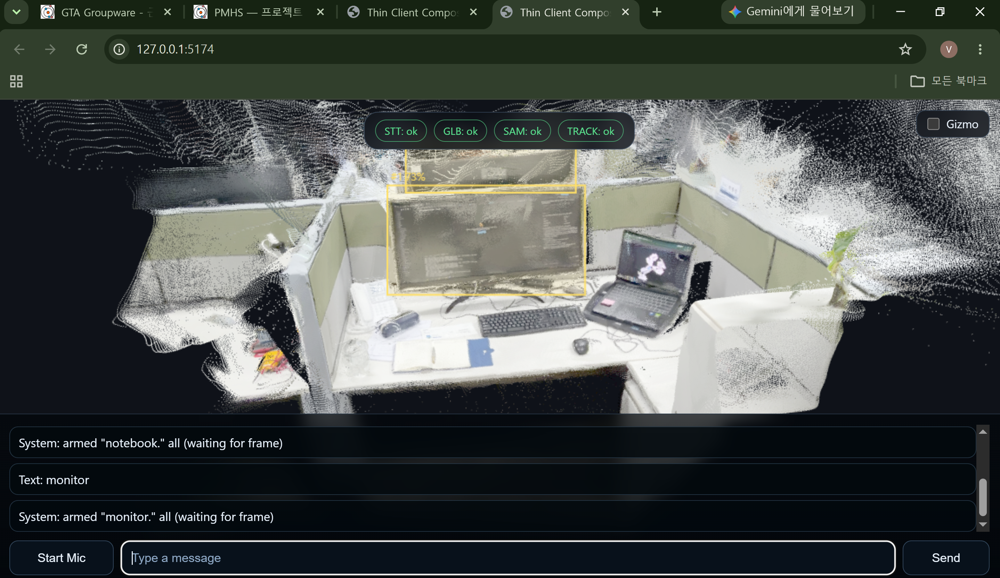

**Tracking — box follows after acquire**

After voice or text acquire, the yellow box stays locked on the object (keyboard here) as the camera / frame pump updates.

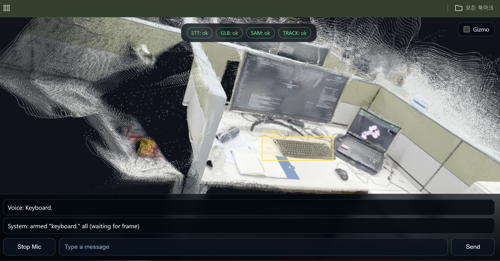

- Health: STT · GLB · SAM · TRACK
- Full-bleed Babylon.js orbit of `scene.glb`
- Click → MobileSAM mask, reprojected as the camera moves
- Voice or text → open-vocab tracking
- Chat dock: mic WebSocket + typed commands

Say: *Mission confirm and SITL fly-out are not in this UI yet. That is the next wire-up, not a rewrite.*

---

## 5 — Perception and mapping

**See first. Fly later.**

Source video is a real desk / cubicle pass — the same workspace the reconstruction was built from.

| Input frames | 3D result in the viewer |
|---|---|
| 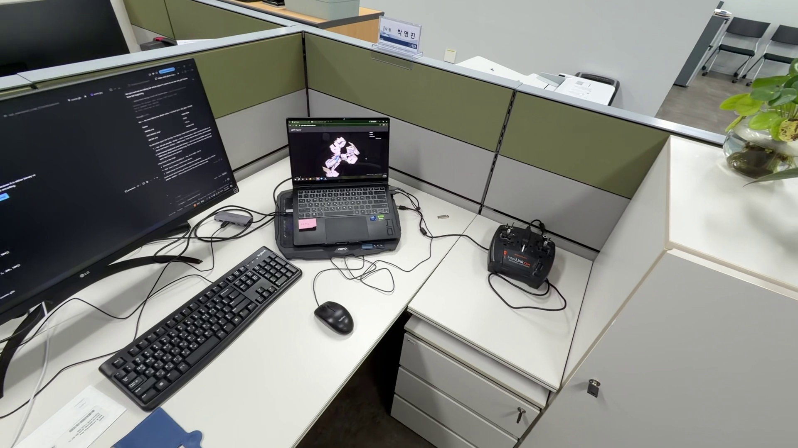 | 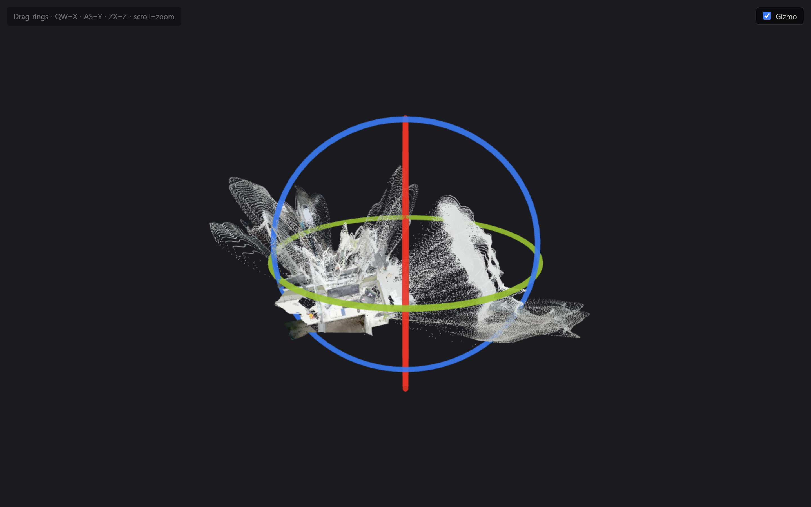 |
| 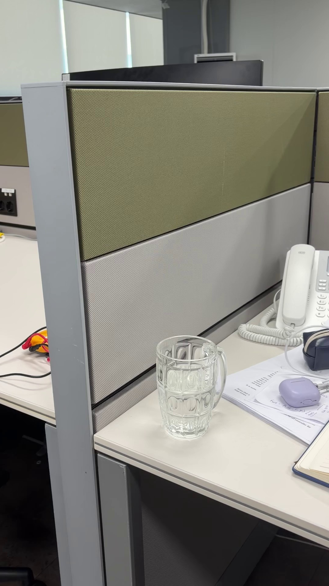 | 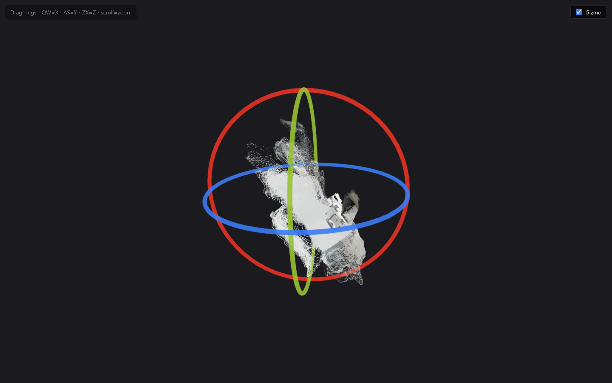 |

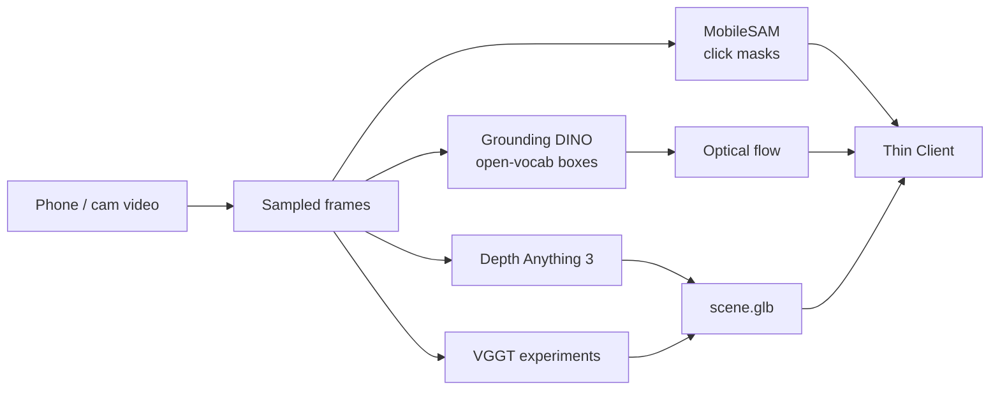

- One shared SAM GPU process — tracker calls `:7860` over HTTP
- ~6 Hz frame pump with epoch guards so stale boxes are dropped
- DA3 batches large clips and Sim(3)-aligns overlap so the scene stays coherent

Say: *I did not train SAM or DA3. The work is the pipeline, the servers, and making them usable in one viewport.*

---

## 6 — Mission contracts

**Missions are data, not prompts**

In-repo example `examples/missions/north_legs.json`: takeoff 3 m → north 200 m → hold 10 s → yaw 90° → north 200 m.

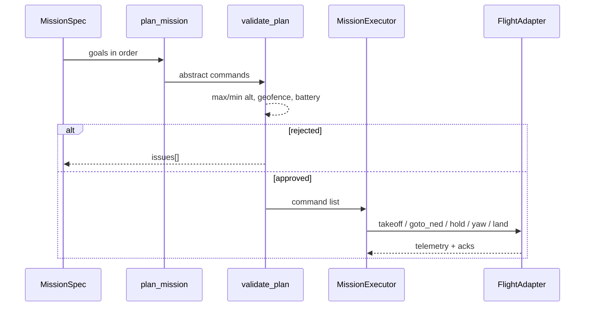

- Schema v1 with geofence, altitude, battery
- Planner keeps goal order; no injected arm/land
- Validator rejects bad alt / fence in unit tests
- Executor is linear; PX4 adapter + mock exist
- ArduPilot adapter is still an empty slot

Say: *Language → spec → human confirm → SITL is the closed loop I have not shipped. The contracts are already there.*

---

## 7 — Future development

**Intended next work — already designed, not yet wired**

These are the features the north star, architecture, and client status already call out. Not a new wishlist invented for the interview.

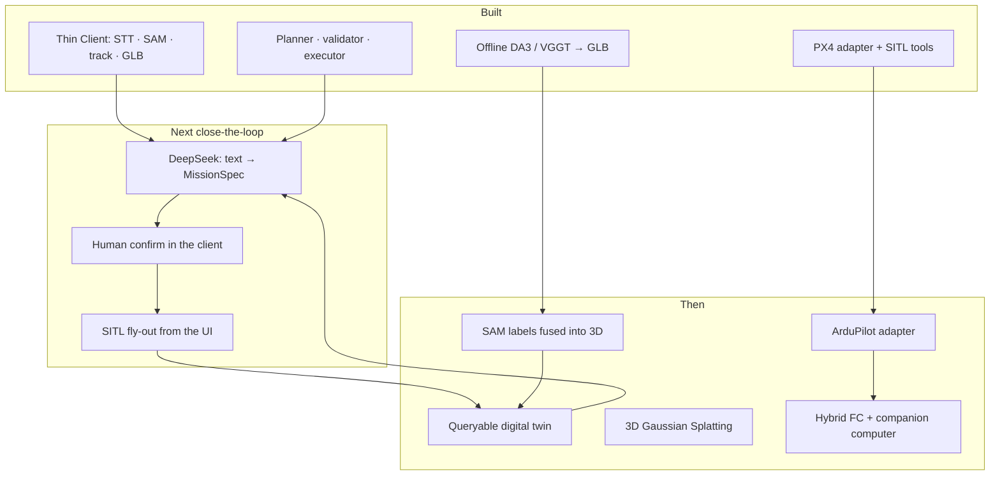

**Close the language-to-flight loop**

- DeepSeek (OpenAI-compatible) emits only a schema-validated MissionSpec
- Human confirmation gate in the Thin Client before anything executes
- Same validator already covered by unit tests
- Executor → `Px4MavlinkAdapter` on PX4 SITL, visible from the UI
- Local TTS for spoken agent replies

**Make the scene operational (digital twin)**

- Scene-graph / twin store (`databases/graph` is still a scaffold)
- Fuse open-vocab masks into the reconstruction so the planner can ask “where is the landing pad?”
- 3D Gaussian Splatting (research pick) on top of the current DA3/VGGT GLB path
- Replay: every sim/flight writes video + telemetry for offline perception

**Simulation, then hardware**

- Finish Phase 0–1: repeatable PX4 SITL + QGC, hover / attitude hold in heli-gym
- Automated pass/fail for scripted takeoff → waypoint → loiter → land
- Close ADR 001 only after airframe choice + Phase 2 in SITL
- Recommended hardware pattern: PX4 or ArduPilot for stabilization; Jetson Orin Nano / Raspberry Pi 5 for perception, mapping, mission, reasoning
- Implement the empty ArduPilot adapter slot if that stack wins
- Camera and RC helicopter enter only when a phase needs physical validation
- ROS 2 / ZeroMQ only if onboard multi-process deployment needs it
- Later optimization: onboard real-time 3DGS SLAM — not a near-term demo

Say: *The next slide in the product is not a new model. It is wiring intent → confirm → SITL through contracts that already exist.*
