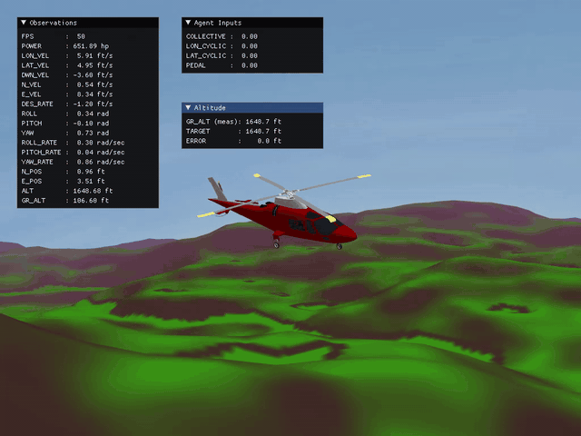
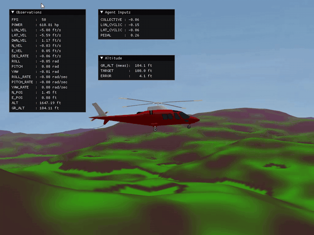
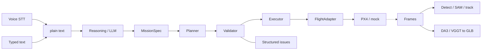
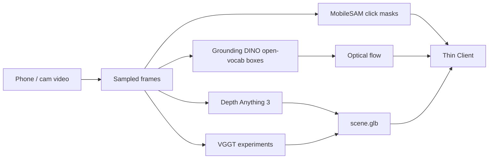
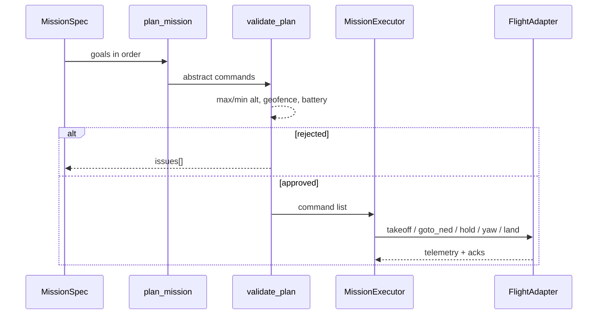
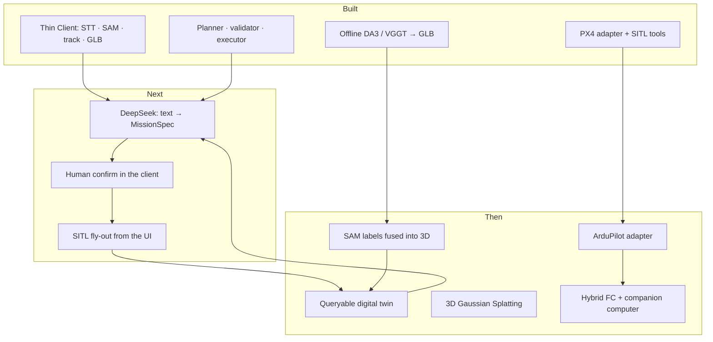

# Helicopter

**A modular autonomy stack for a software-first helicopter.**

Voice or text becomes a typed mission. A deterministic safety gate decides whether it may fly. A thin adapter talks to PX4. Perception and 3D reconstruction run on recorded video, so the system can be developed without flying.

This is not a finished aircraft. It is the software architecture and the parts that run today.


## Pipeline

I built a pipeline that uses open-source models and flight software as interchangeable parts:

- **[RealtimeSTT](audio/RealtimeSTT/)** (faster-whisper) for local voice → text
- **[MobileSAM](vision/third_party/MobileSAM/)** for click-to-mask, **Grounding DINO** for open-vocab boxes
- **[Depth Anything 3](vision/depth-anything-3/)** and **[VGGT](vision/vggt/)** for offline video → `scene.glb`
- **PX4** (SITL today) behind a thin flight adapter
- **Babylon.js** for the reconstructed scene in the ops UI

Around those, the repo owns the composition: mission schemas, planner / validator / executor, perception servers, and the Thin Client that puts STT, masks, tracks, and the GLB in one viewport. Whisper, the detector, or PX4 can be swapped without rewriting the rest.

## Stabilization

[heli-gym](controls/heli-gym/) is a 6-DOF helicopter sim (Heffley–Mnich). With every channel at zero — collective, lon/lat cyclic, pedal — the airframe is open-loop and falls over. I closed that loop with cascaded PID on attitude, then position (`controls/heli-gym/pid/`), so the same model holds hover.

| Open loop — all controls at 0 | After PID |
|---|---|
|  |  |

## Architecture

The LLM never flies the aircraft. Every plan — script, human, or future model — hits the same validator.



| Layer | Job | Must not do |
|---|---|---|
| Human interface | STT or typed text → plain string | Emit setpoints or MAVLink |
| Reasoning | Text → schema-validated `MissionSpec` | Call the flight adapter |
| Mission | Plan, validate, execute in order | Skip the safety gate |
| Flight | Abstract commands → PX4 / other FC | Parse natural language |
| Perception / mapping | Frames → tracks, masks, GLB | Arm or move the vehicle |

- Illegal altitude or geofence is a structured reject, not a prompt hope.
- Abort is explicit RTL or land.
- A failed command stops the mission; it does not auto-land.
- Reasoning is not built yet. The contracts already are.

## Live demo

`python client/launch.py` opens the Thin Client on [http://127.0.0.1:5174](http://127.0.0.1:5174). Health strip: STT · GLB · SAM · TRACK.

**Voice.** Say “keyboard.” Faster-whisper writes the transcript into the chat dock; the tracker arms on that text.


**Open-vocab detect.** Type `monitor`. Grounding DINO returns a scored box on the display. Same path works for `notebook`.


**Track.** After voice or text acquire, the yellow box stays locked as the frame pump updates.


- Full-bleed Babylon.js orbit of `scene.glb`
- Click → MobileSAM mask, reprojected as the camera moves
- Chat dock: mic WebSocket + typed commands

Mission confirm and SITL fly-out are not in this UI yet. That is the next wire-up, not a rewrite.

## Perception and mapping

See first. Fly later. Source video is a real desk / cubicle pass — the same workspace the reconstruction was built from.

| Input frames | 3D result in the viewer |
|---|---|
|  |  |
|  |  |



- One shared SAM GPU process — tracker calls `:7860` over HTTP
- ~6 Hz frame pump with epoch guards so stale boxes are dropped
- DA3 batches large clips and Sim(3)-aligns overlap so the scene stays coherent

## Mission contracts

Missions are data, not prompts. Example: [`examples/missions/north_legs.json`](examples/missions/north_legs.json) — takeoff 3 m → north 200 m → hold 10 s → yaw 90° → north 200 m.



- Schema v1 with geofence, altitude, battery
- Planner keeps goal order; no injected arm/land
- Validator rejects bad alt / fence in unit tests
- Executor is linear; PX4 adapter + mock exist
- ArduPilot adapter is still an empty slot

Language → spec → human confirm → SITL is the closed loop that is not shipped yet. The contracts are already there.

## Status



The next product step is not a new model. It is wiring intent → confirm → SITL through contracts that already exist.

## Run the demo

Needs a local Python env with project + MobileSAM deps, Node.js, and `vision/third_party/MobileSAM/weights/mobile_sam.pt`.

```bash
cd vision/tools/glb-viewer && npm install
cd ../../client && npm install
python client/launch.py
```

The launcher starts STT (`:8010`), MobileSAM (`:7860`), the tracker (`:7861`), the GLB viewer (`:5173`), and the Thin Client (`:5174`). Details: [`client/README.md`](client/README.md).

Mission-core tests (no GPU, no vehicle):

```bash
pytest tests/controls/mission
```

## Docs

| Doc | What it is |
|---|---|
| [`NORTH_STAR.md`](NORTH_STAR.md) | Product objective, phases, non-negotiable safety rule |
| [`docs/ARCHITECTURE.md`](docs/ARCHITECTURE.md) | Module contracts and target layout |
| [`PPT.md`](PPT.md) | Speaker notes for the portfolio walkthrough |
| [`client/README.md`](client/README.md) | How to run and probe the Thin Client |
| [`docs/decisions/001-flight-controller.md`](docs/decisions/001-flight-controller.md) | Flight-stack decision still open behind the adapter |

## Third-party licenses

Vendored trees keep their own licenses. Notable ones:

| Tree | License |
|---|---|
| `audio/RealtimeSTT/` | MIT |
| `vision/third_party/MobileSAM/` | Apache-2.0 |
| `vision/depth-anything-3/` | Apache-2.0 |
| `vision/vggt/` | Meta research license |
| `vision/third_party/sam3/` | Meta SAM license |
| `controls/heli-gym/` | MIT |
